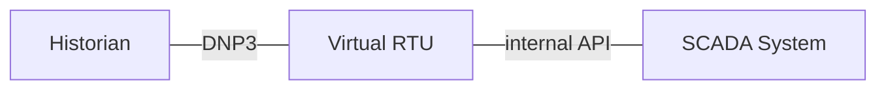
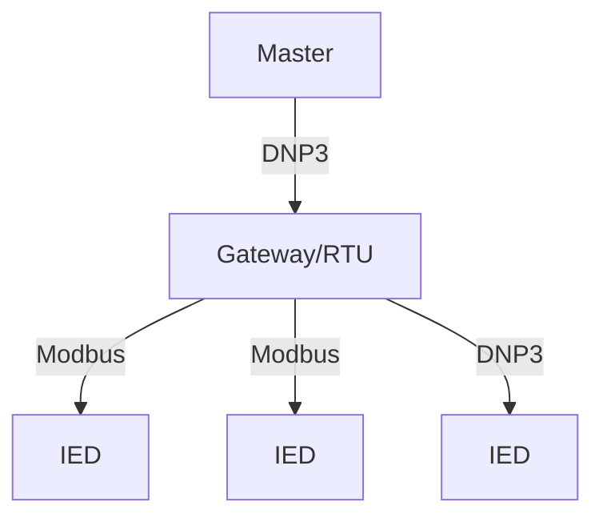
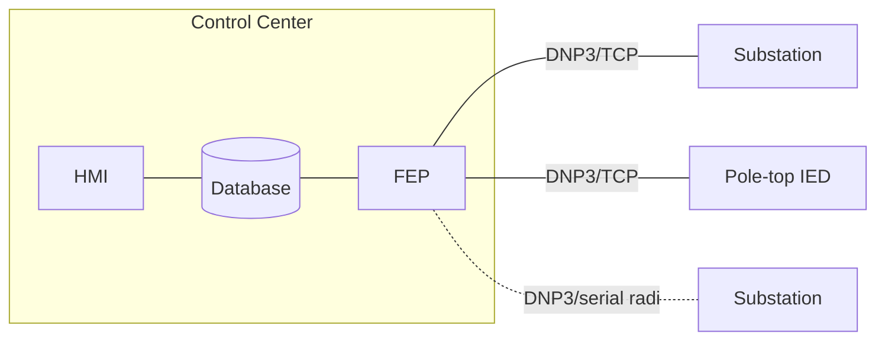
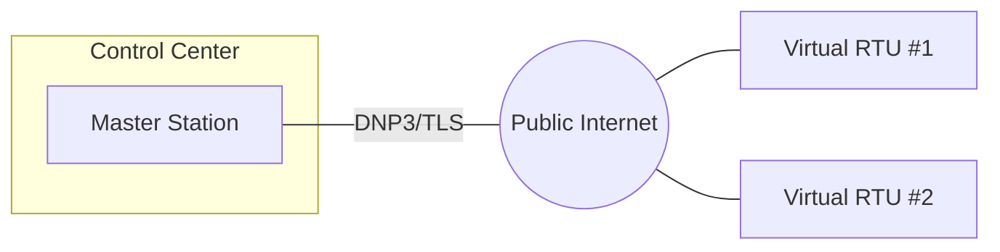

import useBaseUrl from '@docusaurus/useBaseUrl';

DNP3 (IEEE-1815) is the most common SCADA protocol in North America. It is primarily used in electric power 
to monitor and control field assets. DNP3 differs from simple request / response protocols such as Modbus in important ways:

* DNP3 makes efficient use by bandwidth by transferring only points that have changed since the last request or in a purely event-driven *unsolicited* mode.
* Events may be time-tagged at the source of the measurement to millisecond accuracy.
* Measurement *variations* are specified to avoid the ad hoc nature of how non-16-bit values are encoded in multiple Modbus registers. For example, analog
values in DNP3 may be exchanged as signed 16-bit integers, signed 32-bit integers, single precision floats, or double precision floats.
* DNP3 is not purely request-response and is quite complex.

## Outstations

DNP3 outstations are the field devices that provide measurement data and can control physical hardware. Intelligent Electronic Devices (IEDs) that might implement a DNP3 outstation
include:

* Breakers
* Load-tap changers
* Capacitor banks
* Voltage-regulators

When DNP3 is used over TCP/IP, outstations typically act as TCP servers, accepting connections from one or more masters acting as a TCP client.

:::note
Unlike typical client/server architecture where multiple clients can access the same server, DNP3 statefully buffers event data for a *particular* master.
This means that if multiple masters will connect to the same TCP endpoint, their IP addresses must be preconfigured so that the outstation knows which
set of event data to replay to which master.
:::

### Virtual RTUs

Outstations are also frequently used to transfer measurement and control data from a utility SCADA system to a historian or automation process. These applications are
sometimes referred to as a virtual remote terminal unit (RTU), as no separate physical hardware exists for the outstation and it is implemented just as a software
processor within the SCADA server.

### Data concentrators

Often DNP3 outstations will have no physical I/O of their own, but instead will act as protocol translators or gateways to downstream devices. It is common
practice to use DNP3 to communicate from control center to substation, but to a mixture of downstream protocols within the substation itself. Translating
Modbus into DNP3 is common.

## Master stations

Master stations (aka masters) typically communicate with multiple outstations, sometimes over a variety of communication media (TCP, serial, etc). They acquire
measurement data from the outstations by polling or enabling unsolicited reporting.

Masters are typically software components that run on a full server architecture, and are connected to the larger SCADA system within a utility's control
center. DNP3 masters are frequently implementing within what the utility industry calls a *front-end processor* (FEP): a component that handles protocol/transport
specific details on behalf of the larger system.

### Third-party system integration

Increasingly, master stations are used to communicate with 3rd party systems providing control over virtual power plant, load shedding, and distributed energy resources (DER).

These applications typically use Transport Layer Security (TLS) to secure the link over the public Internet.