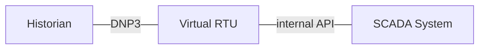
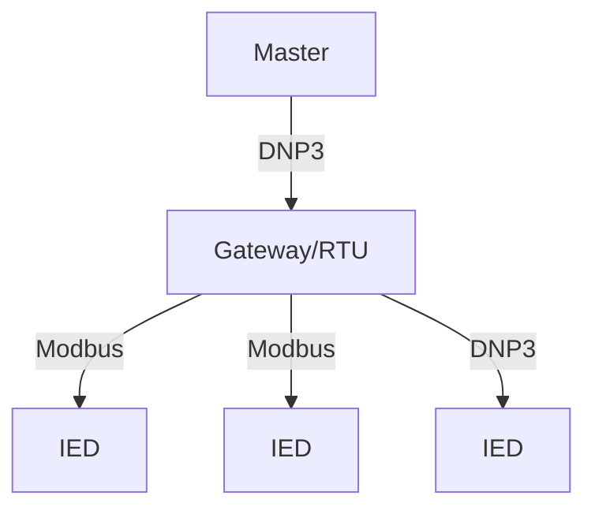
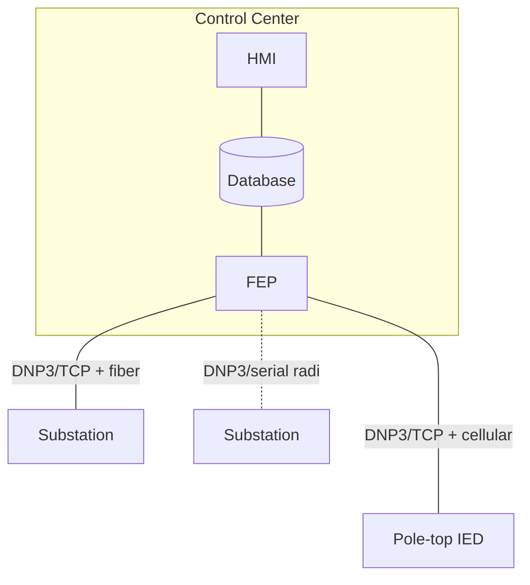
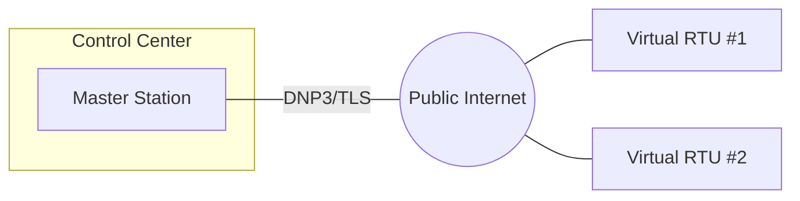

import useBaseUrl from '@docusaurus/useBaseUrl';

DNP3 (IEEE-1815) is primarily used in electric power to monitor and control field assets. Because it is an open standard, it is one of the most common SCADA protocols used in North America. Unlike simple request-response protocols such as Modbus, DNP3 provides several distinct advantages:

* DNP3 optimizes bandwidth by only transferring points that have changed since the last request by polling for these events or pushing them in *unsolicited* mode.
* DNP3 time-tags events at the source of the measurement to millisecond accuracy.
* DNP3 has measurement *variations* so you can avoid the ad hoc manner by which Modbus encodes non-16-bit values in multiple registers. For example, you can exchange analog
values as signed 16-bit integers, signed 32-bit integers, single-precision floats, or double-precision floats.
* DNP3 provides additional capabilities and functionality beyond just request-response.

## Outstations

A DNP3 outstation is a field device that provides measurement data and controls physical hardware. Intelligent Electronic Devices (IEDs) that implement DNP3 include:

* Breakers
* Load-tap changers
* Capacitor banks
* Voltage-regulators

If you use DNP3 over TCP/IP, the outstation typically acts as a TCP server. This lets it accept connections from one or more masters acting as a TCP client.

:::note
Unlike typical client/server architecture where multiple clients can access the same server, DNP3 statefully buffers event data for a specific master.
If you plan to connect multiple masters to the same TCP endpoint, you must preconfigure each IP address in advance so that the outstation knows which event data set to replay to which master.
:::

### Virtual RTUs

You can also use a DNP3 outstation to transfer measurement and control data from a utility SCADA system to a historian or automation process. This is also known as a virtual remote terminal unit (RTU) since you implement it as a software
processor within the SCADA server without separate physical hardware.

### Data concentrators

You'll often see DNP3 outstations with no physical I/O of their own that instead act as protocol translators or gateways to downstream devices. DNP3 is often used to communicate from the control center to a substation, along with downstream protocols within the substation itself. Translating
Modbus into DNP3 is also common.

## Master stations

Master stations, or masters, typically communicate with multiple outstations using a variety of communication media, such as TCP or serial. They collect measurement data from outstations by polling or enabling unsolicited reporting.

Connected to the broader SCADA system within the utility's control center, masters are typically software components that run on a full server architecture. You would commonly implement a DNP3 master within a front-end processor (FEP), which is a component that handles protocol/transport-specific details on behalf of the larger system.

### Third-party system integration

Masters are increasingly used to communicate with third-party systems to enable control over virtual power plants, load shedding, and distributed energy resources (DER). These applications typically use Transport Layer Security (TLS) to secure the link over the public internet.

