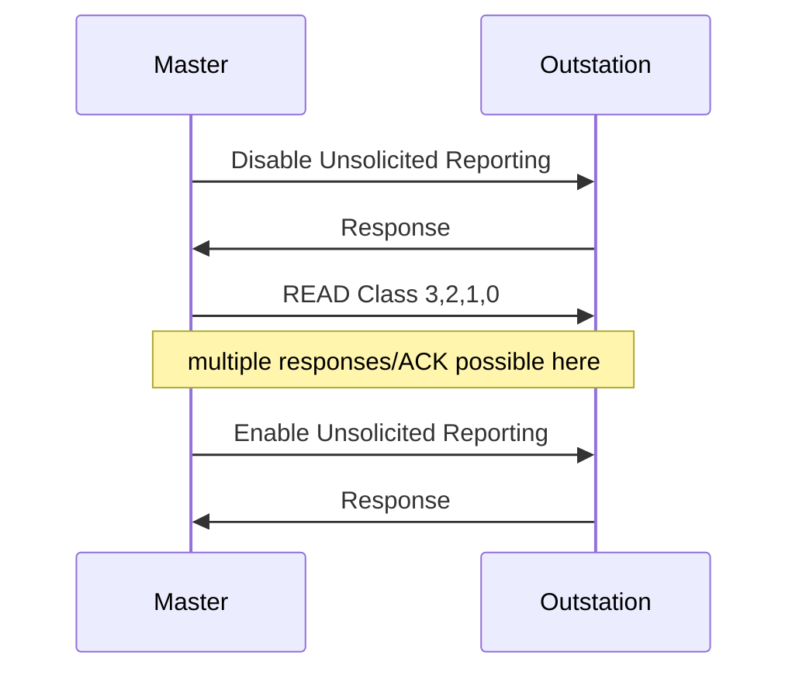

import Tabs from '@theme/Tabs';
import TabItem from '@theme/TabItem';

The `AssociationConfig` struct provides the configuration information you need to communicate with a particular outstation on the communication channel, including:

* Timeout for responses on this association
* Startup handshaking
* If and how to perform time synchronization
* Per-association task queue size

Note that the outstation address is provided as a separate argument when adding an association to a channel.

<Tabs
groupId="language"
defaultValue="Rust"
values={[
{label: 'Rust', value: 'Rust'},
{label: 'C', value: 'C'},
{label: 'C++', value: 'C++'},
{label: 'Java', value: 'Java'},
{label: 'C#', value: 'C#'},
]}>
<TabItem value="Rust">

```rust
{{#include ../dnp3/examples/master.rs:association_config}}
```

</TabItem>
<TabItem value="C">

```c
{{#include ../ffi/bindings/c/master_example.c:association_config}}
```

</TabItem>
<TabItem value="C++">

```cpp
{{#include ../ffi/bindings/c/master_example.cpp:association_config}}
```

</TabItem>
<TabItem value="Java">

```java
{{#include ../ffi/bindings/java/examples/src/main/java/io/stepfunc/dnp3/examples/MasterExample.java:association_config}}
```

</TabItem>
<TabItem value="C#">

```csharp
{{#include ../ffi/bindings/dotnet/examples/master/Program.cs:association_config}}
```

</TabItem>
</Tabs>

## Initialization

The DNP3 standard requires that the master perform these actions during initialization before normal polling can occur:



If your outstation doesn't support unsolicited reporting, you can turn the DISABLE/ENABLE unsolicited requests off by setting
`AssociationConfig.DisableUnsolClasses` and `AssociationConfig.EnableUnsolClasses` to `EventClasses.None()`. The master will then skip unsolicited configuration during initialization, only performing the integrity poll.

## Scheduling

The following algorithm is used to schedule requests within an association:

1. User requests such as control operations get top priority.
2. The association then considers automatic and initialization tasks in this order:
   1. Clear the RESTART IIN bit if previously observed in a response.
   2. Disable unsolicited reporting if configured to do so during initialization.
   3. Perform an integrity scan if configured to do so during initialization.
   4. Perform automatic time synchronization if enabled, and the master observes the 'NEED_TIME IIN' bit in a response.
   5. Enable unsolicited reporting if configured to do so during initialization.
3. Finally, the system will then execute periodic polls.

:::note
The standard does not specify how requests should be scheduled for multiple associations on a channel. Our implementation uses a per-association task queue. The channel scheduler round-robins through the associations to ensure fair access.
:::

The `RESTART` IIN bit is automatically cleared by the master whenever the outstation reports it.
