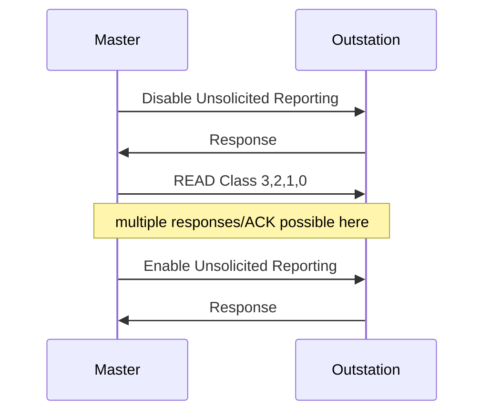

import Tabs from '@theme/Tabs';
import TabItem from '@theme/TabItem';

The `AssociationConfig` struct provides configuration information needed to communicate with a particular outstation on the communication channel including:

* Startup handshaking
* If and how to perform time synchronization
* Per-association task queue size

The outstation address is supplied as a separate argument when adding an association to a channel.

<Tabs
groupId="language"
defaultValue="Rust"
values={[
{label: 'Rust', value: 'Rust'},
{label: 'C', value: 'C'},
{label: 'Java', value: 'Java'},
{label: 'C#', value: 'C#'},
]}>
<TabItem value="Rust">

```rust
{{#include ../dnp3/examples/master_tcp_client.rs:association_config}}
```

</TabItem>
<TabItem value="C">

```c
{{#include ../ffi/bindings/c/master_example.c:association_config}}
```

</TabItem>
<TabItem value="Java">

```java
{{#include ../ffi/bindings/java/examples/src/main/java/io/stepfunc/dnp3rs/examples/MasterExample.java:association_config}}
```

</TabItem>
<TabItem value="C#">

```csharp
{{#include ../ffi/bindings/dotnet/examples/master/Program.cs:association_config}}
```

</TabItem>
</Tabs>

## Initialization

The DNP3 standard requires that the master perform certain actions during initialization before normal polling occurs:



If an outstation does not support unsolicited reporting, you may turn the DISABLE/ENABLE unsolicited requests off by setting
`AssociationConfig.DisableUnsolClasses` and `AssociationConfig.EnableUnsolClasses` to `EventClasses.None()`. The master will
skip unsolicited configuration during initialization and only perform the integrity poll.

## Scheduling

The standard leaves a lot up to implementations regarding scheduling. The algorithm used to schedule requests on a channel follows the steps outlined below.
Each association maintains its own task queue, and the channel uses a round-robin queue to ensure fairness across associations on the channel.

1. Users requests such as control operations are always given the highest priority
2. Automatic and initialization tasks are then considered in this order:
   1. Clear the RESTART IIN bit if it has been previously observed in a response
   2. Disable unsolicited reporting if configured to do so during initialization
   3. Perform an integrity scan if configured to do so during initialization
   4. Perform automatic time synchronization if configured and the NEED_TIME IIN bit has been observed in a response
   5. Enable unsolicited reporting if configured to do so during initialization
3. Periodic polls are then executed if there is nothing else to do.


