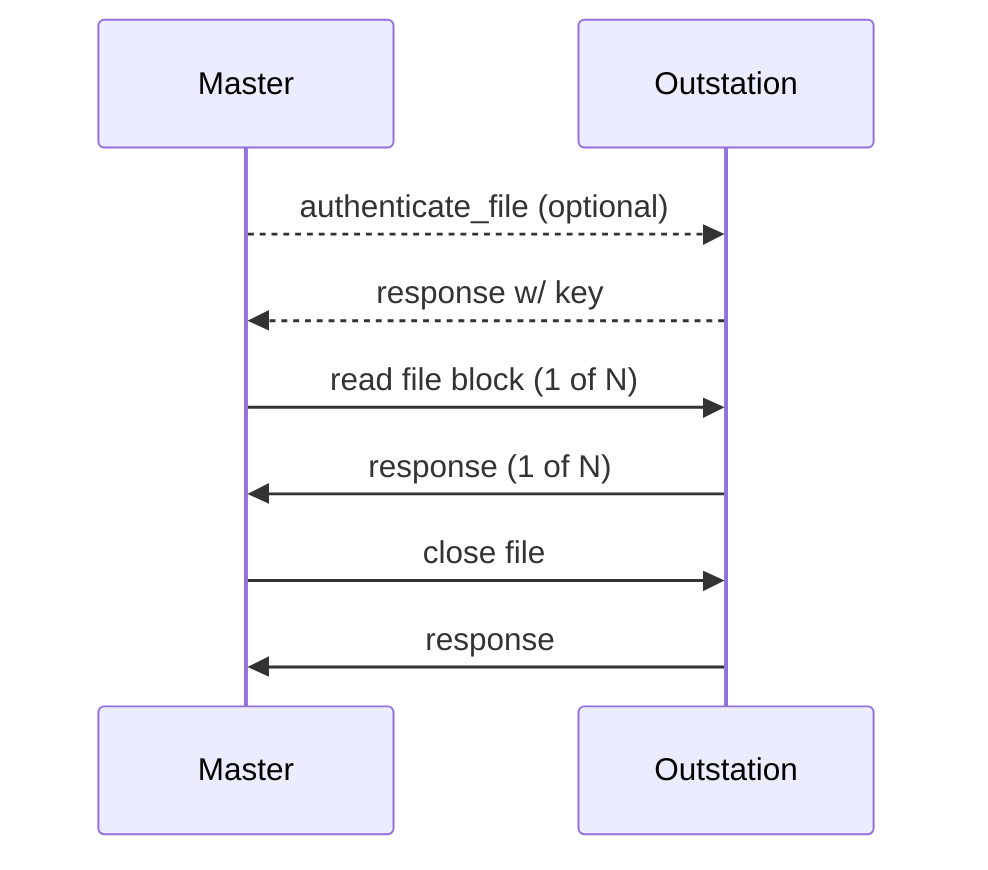

import Tabs from '@theme/Tabs';
import TabItem from '@theme/TabItem';

File transfer in DNP3 is defining using objects from Group 70. The Master API allows you to do several operations related
to file transfer:

* Get file info - Retrieve information on an individual file or directory
* Read file - Read a remote file from the outstation asynchronously
* Read directory listing - Read a directory information from the outstation

## Get File Info

Information about a single file or directory may be retrieved from outstation using a single method invocation.

<Tabs
groupId="language"
defaultValue="Rust"
values={[
{label: 'Rust', value: 'Rust'},
{label: 'C', value: 'C'},
{label: 'C++', value: 'C++'},
{label: 'Java', value: 'Java'},
{label: 'C#', value: 'C#'},
]}>
<TabItem value="Rust">

```rust
{{#include ../dnp3/examples/master.rs:get_file_info}}
```

</TabItem>
<TabItem value="C">

```c
This is possible, but not part of the C example!
```

</TabItem>
<TabItem value="C++">

```cpp
// Callback interface
{{#include ../ffi/bindings/c/master_example.cpp:file_info_callback}}

// asynchronously start the operation
{{#include ../ffi/bindings/c/master_example.cpp:get_file_info}}
```

</TabItem>
<TabItem value="Java">

```java
{{#include ../ffi/bindings/java/examples/src/main/java/io/stepfunc/dnp3/examples/MasterExample.java:get_file_info}}
```

</TabItem>
<TabItem value="C#">

```csharp
{{#include ../ffi/bindings/dotnet/examples/master/Program.cs:get_file_info}}
```

</TabItem>
</Tabs>

## Read a File

File data may be asynchronously read from the outstation using a callback interface. Reading a file consists of multiple
DNP3 requests. Obtaining an authentication key from the outstation and is optional depending on outstation requirements.



The `FileReader` interface is used to receive data from the outstation as it is read. Your code is responsible for doing
something with this data, e.g. writing it to a local file.

<Tabs
groupId="language"
defaultValue="Rust"
values={[
{label: 'Rust', value: 'Rust'},
{label: 'C', value: 'C'},
{label: 'C++', value: 'C++'},
{label: 'Java', value: 'Java'},
{label: 'C#', value: 'C#'},
]}>
<TabItem value="Rust">

```rust
{{#include ../dnp3/examples/master.rs:file_logger}}

// asynchronously start the transfer
{{#include ../dnp3/examples/master.rs:read_file}}
```

</TabItem>
<TabItem value="C">

```c
This is possible, but not part of the C example!
```

</TabItem>
<TabItem value="C++">

```cpp
// Callback interface
{{#include ../ffi/bindings/c/master_example.cpp:file_logger}}

// asynchronously start the operation
{{#include ../ffi/bindings/c/master_example.cpp:read_file}}
```

</TabItem>
<TabItem value="Java">

```java
{{#include ../ffi/bindings/java/examples/src/main/java/io/stepfunc/dnp3/examples/MasterExample.java:file_logger}}

// asynchronously start the operation
{{#include ../ffi/bindings/java/examples/src/main/java/io/stepfunc/dnp3/examples/MasterExample.java:read_file}}
```

</TabItem>
<TabItem value="C#">

```csharp
{{#include ../ffi/bindings/dotnet/examples/master/Program.cs:file_logger}}

// asynchronously start the operation
{{#include ../ffi/bindings/dotnet/examples/master/Program.cs:read_file}}
```

</TabItem>
</Tabs>

:::tip
There is no need to manually close a file. The master will always attempt to close a file, even if the file operation
is aborted by the user.
:::

## Read a Directory

A directory listing in DNP3 is just a special kind of file with a special encoding. We implement this feature by starting
a background file transfer, accumulating the file data over possibly multiple blocks, and then parsing it into a collection
of `FileInfo` instances.

:::warning
The default limit for the size of directory file is 2048 bytes. This is a reasonable and safe limit, however, if its too
small in your application you can raise this limit using the provided parameter in `DirReadConfig`.
:::

<Tabs
groupId="language"
defaultValue="Rust"
values={[
{label: 'Rust', value: 'Rust'},
{label: 'C', value: 'C'},
{label: 'C++', value: 'C++'},
{label: 'Java', value: 'Java'},
{label: 'C#', value: 'C#'},
]}>
<TabItem value="Rust">

```rust
{{#include ../dnp3/examples/master.rs:read_directory}}
```

</TabItem>
<TabItem value="C">

```c
This is possible, but not part of the C example!
```

</TabItem>
<TabItem value="C++">

```cpp
// Callback interface
{{#include ../ffi/bindings/c/master_example.cpp:read_directory_callback}}

// asynchronously start the operation
{{#include ../ffi/bindings/c/master_example.cpp:read_directory}}
```

</TabItem>
<TabItem value="Java">

```java
{{#include ../ffi/bindings/java/examples/src/main/java/io/stepfunc/dnp3/examples/MasterExample.java:read_directory}}
```

</TabItem>
<TabItem value="C#">

```csharp
{{#include ../ffi/bindings/dotnet/examples/master/Program.cs:read_directory}}
```

</TabItem>
</Tabs>