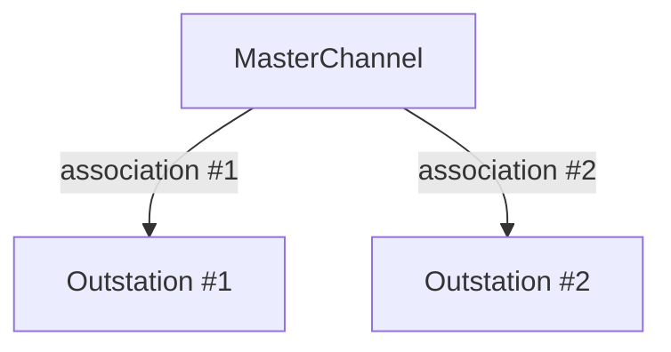

import Tabs from '@theme/Tabs';
import TabItem from '@theme/TabItem';

Master stations communicate with multiple outstations over multiple communication channels. The following sections describe how to create different channel types, each supporting multiple outstations.

## MasterChannel

Create a `MasterChannel` using generic configuration combined with transport-specific options. All channel instances have the same API regardless of the underlying transport.

## Association

The DNP3 standard defines an association as "a representation of a logical connection between a master and an outstation". In this library, you add an association to a `MasterChannel` to enable communication with a particular outstation address. Adding an association to a channel will return an `AssociationId`, which can then be used in conjunction with the channel to perform actions on that outstation.

:::note
It's typical to just have one association per channel over TCP. However, it's also possible to encounter virtual outstations on a single TCP endpoint. Serial channels are frequently part of a multi-drop network where a single serial channel is used to communicate with multiple independent outstations.
:::

