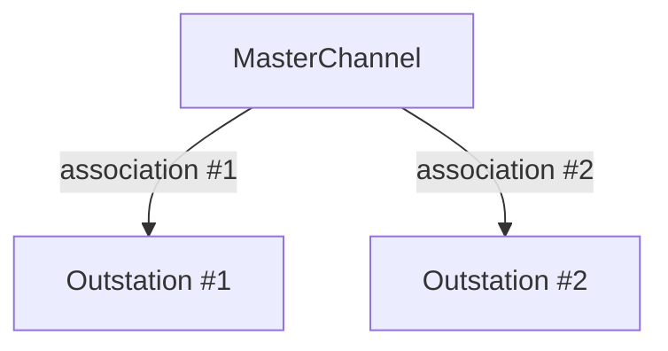

import Tabs from '@theme/Tabs';
import TabItem from '@theme/TabItem';

Master stations are typically capable of communicating with multiple outstations over multiple communication channels.
The API documentation describes how to talk to one more outstations over a single communication channel. Talking over
multiple channels is accomplished by invoking the API multiple times.

## MasterChannel

In this library, a `MasterChannel` is created using some generic configuration and some transport specific configuration. It
represents the communication channel itself and how it will behave. Once created, all channel instances have the same API
regardless of the underlying transport.

## Association

An association is defined in the standard as "a representation of a logical connection between a master and an outstation".
In this library, an association is added to a `MasterChannel`, enabling communication with a particular outstation address. Adding an
association to a channel returns an `AssociationId` which can then be used in conjunction with the channel to perform actions on that outstation.

Over TCP, it is typical to only have a single association per channel, however, it is possible to encounter virtual outstations on a single TCP
endpoint. Serial channels are frequently part of a multi-drop network where a single serial interface communicates with multiple independent outstations.

