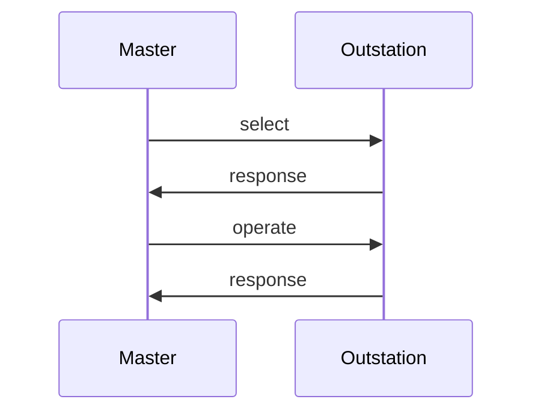

import Tabs from '@theme/Tabs';
import TabItem from '@theme/TabItem';

The `ControlHandler` interface receives control requests. Each request begins with `beginFragment` and ends with `endFragment`, useful for handling operations atomically or in batches. 

Each `select` or `operate` callback returns a `CommandStatus` enum. The outstation response to a control message echoes the request data and this
status code is returned for every control in the message. The library actually builds the response message while making these callbacks.

## Handling SELECT

The `select*` methods of `ControlHandler` are called when a properly formatted `SELECT` message is received from the master.  Selecting a control
point should never cause the point to operate.  Instead, think of this request from the master to mean, "Do you support this?"



DNP3 masters can also use a "select-before-operate" strategy. The rules for processing these two-pass control messages are complex, but the library handles them automatically.

## Handling OPERATE

The `operate*` methods of `ControlHandler` are called when the outstation receives either:

* `OPERATE` function code preceded by a matching `SELECT`.
* `DIRECT_OPERATE` function code (single-pass control with response).
* `DIRECT_OPERATE_NO_RESPONSE` function code (single-pass control without a response).

A `DatabaseHandle` reference lets you update point values in response to controls. Typically used for `BinaryOutputStatus` and `AnalogOutputStatus`, but you can update other types too—for example, tracking control operations in a counter.

:::tip
Every call to `DatabaseHandle.transaction` locks and unlocks a mutex. Since DNP3 can carry multiple controls in a single message, the most
efficient way to update feedback points is to do a single transaction in the `ControlHandler.end_fragment` method.
:::

:::note
The OperateType enum lets you identify which of the three operate function codes invoked the method. You can probably ignore this value. The specification
requires all three control methodologies to be supported and result in the same action.
:::

<Tabs
groupId="language"
defaultValue="Rust"
values={[
{label: 'Rust', value: 'Rust'},
{label: 'C', value: 'C'},
{label: 'C++', value: 'C++'},
{label: 'Java', value: 'Java'},
{label: 'C#', value: 'C#'},
]}>
<TabItem value="Rust">

```rust
{{#include ../examples/outstation/src/main.rs:control_handler}}
```

</TabItem>
<TabItem value="C">

```c
{{#include ../ffi/bindings/c/outstation_example.c:control_handler}}
// check error
```

</TabItem>
<TabItem value="C++">

```cpp
{{#include ../ffi/bindings/c/outstation_example.cpp:control_handler}}
// check error
```

</TabItem>
<TabItem value="Java">

```java
{{#include ../ffi/bindings/java/examples/src/main/java/io/stepfunc/dnp3/examples/OutstationExample.java:control_handler}}
```

</TabItem>
<TabItem value="C#">

```csharp
{{#include ../ffi/bindings/dotnet/examples/outstation/Program.cs:control_handler}}
```

</TabItem>
</Tabs>

