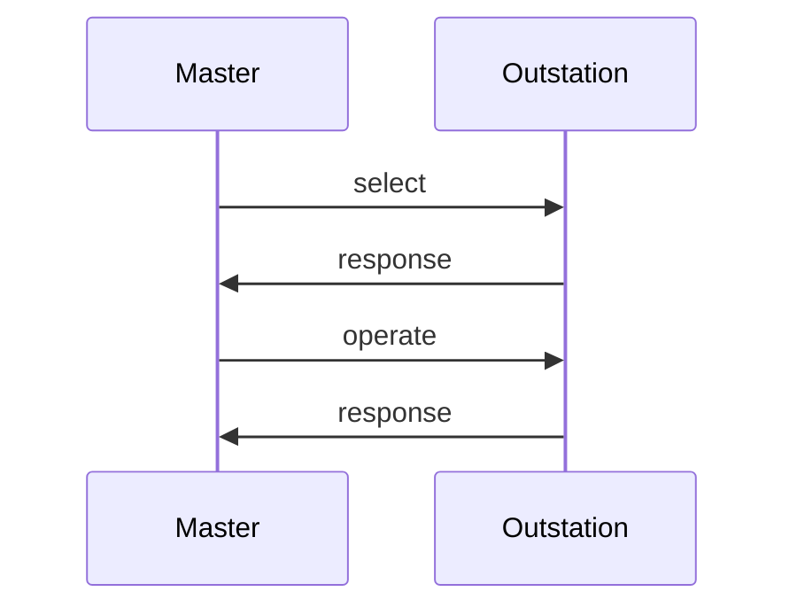

import Tabs from '@theme/Tabs';
import TabItem from '@theme/TabItem';

The `ControlHandler` interface lets application code receive control requests. Each request begins with a call to `beginFragment` and ends
with a call to `endFragment`. These callbacks are helpful if you want the application to handle operations atomically or in batches of some sort. 

## Handling SELECT

The master uses the `select*` methods of `ControlHandler` when it sends a properly formatted `SELECT` function code.  Selecting a control
point should never cause the point to operate.  Instead, think of this request from the master to mean, "Do you support this?"

DNP3 masters can also use a "select-before-operate" strategy to execute controls. The rules for how outstations process these
two-pass control messages are complex. Luckily, the library will handle all the rules for you with complete transparency.

## Handling OPERATE

The outstation uses the `operate*` methods of ControlHandler when it receives one of the following:

* `OPERATE` function code preceded by a matching `SELECT`.
* `DIRECT_OPERATE` function code (single-pass control with response).
* `DIRECT_OPERATE_NO_RESPONSE` function code (single-pass control without a response).

A reference to the `Database` also lets the outstation update point values in response to a control request. While you would typically use it to update `BinaryOutputStatus` and `AnalogOutputStatus` values, you can also use it to update other types if required by the application.

:::note
The OperateType enum lets you identify which of the three operate function codes invoked the method. You can ignore this value, as the specification requires that all three functions be supported and that the outstation's action be the same.
:::

