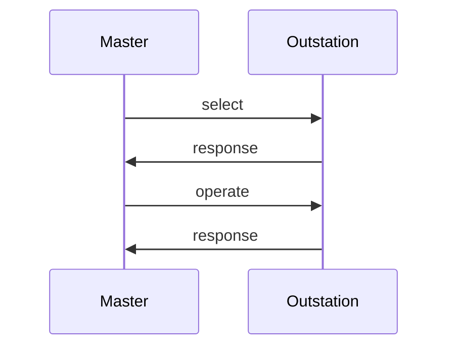

import Tabs from '@theme/Tabs';
import TabItem from '@theme/TabItem';

The `ControlHandler` interface lets application code receive control requests. Each request begins with a call to `beginFragment` and ends
with a call to `endFragment`. These callbacks are helpful if you want the application to handle operations atomically or in batches of some sort. 


## Handling SELECT

The `select*` methods of `ControlHandler` are called when a properly formatted `SELECT` messaged is received from the master.  Selecting a control
point should never cause the point to operate.  Instead, think of this request from the master to mean, "Do you support this?"



DNP3 masters can also use a "select-before-operate" strategy to execute controls. The rules for how outstations process these
two-pass control messages are complex. The library will handle all these rules for you automatically.

## Handling OPERATE

The `operate*` methods of `ControlHandler` are called when the outstation receives either:

* `OPERATE` function code preceded by a matching `SELECT`.
* `DIRECT_OPERATE` function code (single-pass control with response).
* `DIRECT_OPERATE_NO_RESPONSE` function code (single-pass control without a response).

A reference to the `Database` also lets you update point values in response to a control request. While you would typically use it to update `BinaryOutputStatus` and `AnalogOutputStatus` values, you can also use it to update other types if required by the application.
For example, you might maintain the number of control operations performed in a DNP3 counter value.

:::note
The OperateType enum lets you identify which of the three operate function codes invoked the method. You can probably ignore this value. The specification requires all three control methodologies be supported and result in the same action.
:::


:::warning
The outstation automatically performs a transaction on the database when a control ASDU is received. Always use
the provided `Database` argument to update values in ControlHandler callbacks. Calling `Outstation.transaction`
inside of `ControlHandler` callback will result in deadlock.
:::

<Tabs
groupId="language"
defaultValue="Rust"
values={[
{label: 'Rust', value: 'Rust'},
{label: 'C', value: 'C'},
{label: 'C++', value: 'C++'},
{label: 'Java', value: 'Java'},
{label: 'C#', value: 'C#'},
]}>
<TabItem value="Rust">

```rust
{{#include ../dnp3/examples/outstation.rs:control_handler}}
```

</TabItem>
<TabItem value="C">

```c
{{#include ../ffi/bindings/c/outstation_example.c:control_handler}}
// check error
```

</TabItem>
<TabItem value="C++">

```cpp
{{#include ../ffi/bindings/c/outstation_example.cpp:control_handler}}
// check error
```

</TabItem>
<TabItem value="Java">

```java
{{#include ../ffi/bindings/java/examples/src/main/java/io/stepfunc/dnp3/examples/OutstationExample.java:control_handler}}
```

</TabItem>
<TabItem value="C#">

```csharp
{{#include ../ffi/bindings/dotnet/examples/outstation/Program.cs:control_handler}}
```

</TabItem>
</Tabs>

