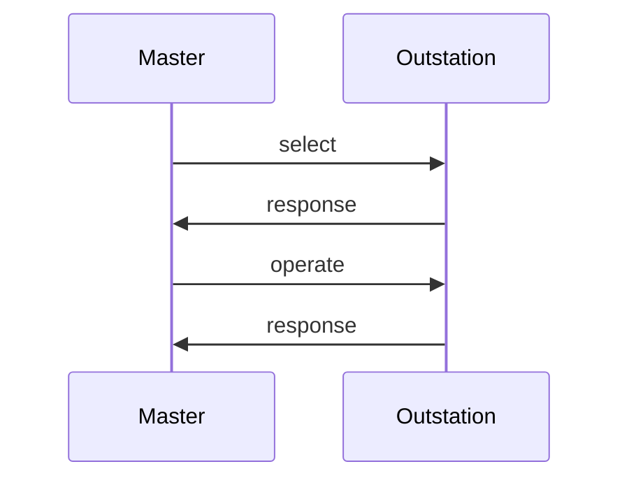

import Tabs from '@theme/Tabs';
import TabItem from '@theme/TabItem';

The `ControlHandler` interface allows application code to receive control and counter freeze requests. Each request begins with a call to `beginFragment` and ends
with a call to `endFragment`. These two callbacks are useful if the application wishes to handle operations atomically or in batches of some sort.

## Handling SELECT

The `select*` methods of `ControlHandler` are invoked when a properly formatted `SELECT` function code is received from the master.  Selecting a control
point should never cause the point to operate.  Implementors should think of this request from the master as meaning "Do you support this?".

DNP3 masters may optionally use a "select-before-operate" strategy for executing controls. The rules for how outstations are required to process these
two-pass control messages are complex. The library transparently handles all of the rules for you.

## Handling OPERATE

The `operate*` methods of ControlHandler are invoked when the outstation receives either:

* `OPERATE` function code preceded by a matching `SELECT`.
* `DIRECT_OPERATE` function code (single-pass control with response).
* `DIRECT_OPERATE_NO_RESPONSE` function code (single-pass control without a response).

A reference to the `Database` is provided so that the outstation may update point values in response to a control request. This would
typically be used to update `BinaryOutputStatus` and `AnalogOutputStatus` values but could be used to update other types if required by the application.

:::note
The OperateType enum is provided which allows the user to tell which of the three operate function codes caused the method to be invoked. Most users
should ignore this value. The specification requires that all three functions be supported and that the action the outstation takes be the same.
:::

## Handling Freeze Requests

`ControlHandler` contains two methods related to freezing counters:

* `freezeCountersAll` - called when a counter freeze operation is received using the All Points (0x06) qualifier
* `freezeCountersRange` - called when a counter freeze operation is received using 8-bit (0x00) or 16-bit (0x01) range qualifiers

The `FreezeType` parameter allows the user to discern between the two types of supported freeze operations:

* `IMMEDIATE_FREEZE` - Copy the current value of a counter to the associated frozen counter point
* `FREEZE_AND_CLEAR` - Copy the current value of a counter to the associated frozen counter point and clear the current value to 0.

A reference to the `Database` is provided to allow the user to perform the requested freeze operations.

