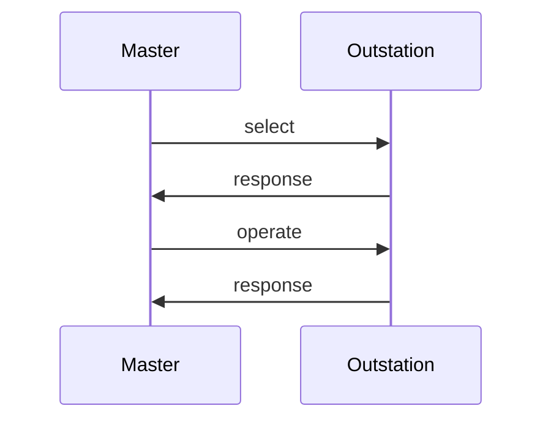

import Tabs from '@theme/Tabs';
import TabItem from '@theme/TabItem';

Outstations may be created once an instance of a `Runtime` is available. The exact process for creating an outstation is slightly different
depending on the physical layer, e.g. TCP vs serial, although most of the configuration options and callback interfaces are the same.

## Common Components

This section describes the common configuration that must be supplied to create an outstation, regardless of which physical layer is used. Transport
specific configuration (TCP, serial, etc) is covered in the next section.

### OutstationConfig

The `OutstationConfig` structure contains parameters that modify the behavior of the outstation. Refer to the generated API documentation for the meaning of
each field. All of the fields, with the exception of the master and outstation link addresses, have default values. This does not mean that these defaults will
function well for all use cases. The timeout parameters, for example, may need to be adjusted for higher latency links.

<Tabs
groupId="language"
defaultValue="Rust"
values={[
{label: 'Rust', value: 'Rust'},
{label: 'C', value: 'C'},
{label: 'Java', value: 'Java'},
{label: 'C#', value: 'C#'},
]}>
<TabItem value="Rust">

```rust
{{#include ../dnp3/examples/outstation_tcp_server.rs:outstation_config}}
```

</TabItem>
<TabItem value="C">

```c
{{#include ../ffi/bindings/c/outstation_example.c:outstation_config}}
```

</TabItem>
<TabItem value="Java">

```java
{{#include ../ffi/bindings/java/examples/src/main/java/io/stepfunc/dnp3rs/examples/OutstationExample.java:outstation_config}}
```

</TabItem>
<TabItem value="C#">

```csharp
{{#include ../ffi/bindings/dotnet/examples/outstation/Program.cs:outstation_config}}
```

</TabItem>
</Tabs>

### EventBufferConfig


The `EventBufferConfig` struct controls how many events are buffered for each type that can be reported by the outstation. Space for
each type is pre-allocated during outstation initialization. When all of the space in the buffer for a particular type has been exhausted, adding
another event will cause the oldest event to be discarded and the outstation will assert IIN 2.3 (Event Buffer Overflow) per the specification.

There is no "correct" number of events to configure. There is a fundamental tradeoff between saving events for future reporting and memory/CPU usage.
You should scale your event buffer sizes based on several factors:

1. How many measurements are contained in the outstation database and how often they change.
2. How often and for how long the master may be disconnected or otherwise unable to empty the event queues via READ or unsolicited reporting.
3. How important it is to never loose events for a particular type. For example, it may be more important to never miss binary state transitions
but missing an analog or counter value might not matter at all.

<Tabs
groupId="language"
defaultValue="Rust"
values={[
    {label: 'Rust', value: 'Rust'},
    {label: 'C', value: 'C'},
    {label: 'Java', value: 'Java'},
    {label: 'C#', value: 'C#'},
]}>
<TabItem value="Rust">

```rust
// Rust example only uses analogs so that's all we need to configure
{{#include ../dnp3/examples/outstation_tcp_server.rs:event_buffer_config}}
```

</TabItem>
<TabItem value="C">

```c
{{#include ../ffi/bindings/c/outstation_example.c:event_buffer_config}}
```

</TabItem>
<TabItem value="Java">

```java
{{#include ../ffi/bindings/java/examples/src/main/java/io/stepfunc/dnp3rs/examples/OutstationExample.java:event_buffer_config}}
```

</TabItem>
<TabItem value="C#">

```csharp
{{#include ../ffi/bindings/dotnet/examples/outstation/Program.cs:event_buffer_config}}
```

</TabItem>
</Tabs>

:::note
Setting the number of events for a particular type to `0` ensures that events will never be recorded or reported for that type.
:::

### ControlHandler

The `ControlHandler` allows application code to receive control and counter freeze requests. Each ASDU received will begin with a call to `beginFragment` and end
with a call to `beginFragment`. These two callbacks are useful if the application wishes to handle these operations atomically or in batches of some sort.


#### Handling SELECT

The `select*` methods of `ControlHandler` are invoked when a properly formatted `SELECT` function code is received from the master.  Selecting a control
point should never cause the point to operate.  Implementors should think of this request from the master as meaning "Do you support this?".



DNP3 masters may optionally use a "select-before-operate" strategy for executing controls. The rules for how outstations are required to process these
two-pass control messages are complex. The library transparently handles all of the rules for you.

#### Handling OPERATE

The `operate*` methods of ControlHandler are invoked when the outstation receives either:

* `OPERATE` function code preceded by a matching `SELECT`.
* `DIRECT_OPERATE` function code (single-pass control with response).
* `DIRECT_OPERATE_NO_RESPONSE` function code (single-pass control without a response).

A reference to the `Database` is provided so that the outstation may update point values in response to a control request. This would
typically be used to update `BinaryOutputStatus` and `AnalogOutputStatus` values but could be used to update other types if required by the application.


:::note
The OperateType enum is provided which allows the user to tell which of the three operate function codes caused the method to be invoked. Most users
should ignore this value. The specification requires that all three functions be supported and that the action the outstation takes be the same.
:::

#### Freeze Operations

`ControlHandler` contains two methods related to freezing counters:

* `freezeCountersAll` - called when a counter freeze operation is received using the All Points (0x06) qualifier
* `freezeCountersRange` - called when a counter freeze operation is received using 8-bit (0x00) or 16-bit (0x01) range qualifiers

The `FreezeType` parameter allows the user to discern between the two types of supported freeze operations:

* `IMMEDIATE_FREEZE` - Copy the current value of a counter to the associated frozen counter point
* `FREEZE_AND_CLEAR` - Copy the current value of a counter to the associated frozen counter point and clear the current value to 0.

A reference to the `Database` is provided to allow the user to perform the requested freeze operations.

### OutstationApplication

The `OutstationApplication` interface handles callbacks to application code that are required for outstation to properly function.

## TCP Server

One or more outstation instances may be associated with a TCP server.


