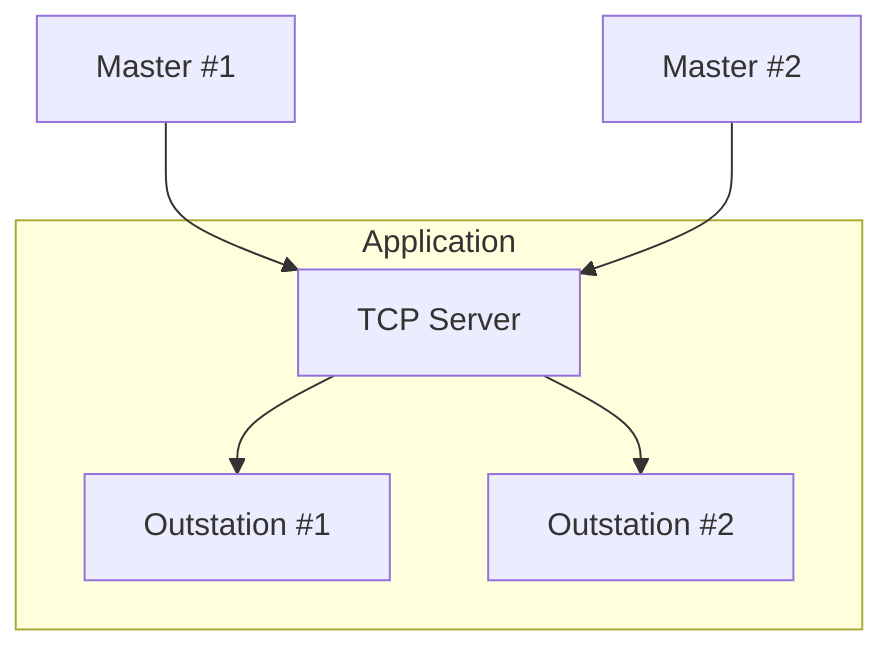
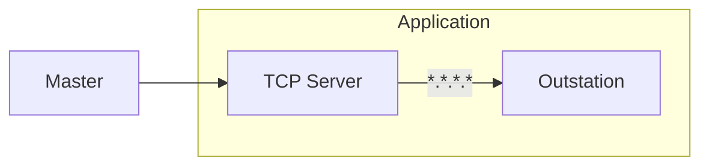

import Tabs from '@theme/Tabs';
import TabItem from '@theme/TabItem';

You can bind one or more outstation instances to a TCP server using an `AddressFilter`. Unlike most server protocols, each outstation instance can only
communicate with one client at a time. This is because DNP3 is stateful and maintains event data for a specific master. If you need to support more than
one master connection on the same port, you must preconfigure each master IP address and associate it with a specific outstation instance.



## Creating a server

Begin by creating a `TCPServer` instance. Keep in mind that creating a server doesn't initiate `bind/listen` immediately. Endpoints are specified in the format `<address>:<port>`. Addresses may be any specified as any valid IPv4 or IPv6 local endpoint, such as:

* `127.0.0.1` for localhost only
* `0.0.0.0` for all adapters
* The IP address for a particular adapter


<Tabs
groupId="language"
defaultValue="Rust"
values={[
{label: 'Rust', value: 'Rust'},
{label: 'C', value: 'C'},
{label: 'C++', value: 'C++'},
{label: 'Java', value: 'Java'},
{label: 'C#', value: 'C#'},
]}>
<TabItem value="Rust">

```rust
{{#include ../dnp3/examples/outstation.rs:create_tcp_server}}
```

</TabItem>
<TabItem value="C">

```c
{{#include ../ffi/bindings/c/outstation_example.c:create_tcp_server}}
// check error
```

</TabItem>
<TabItem value="C++">

```cpp
{{#include ../ffi/bindings/c/outstation_example.cpp:create_tcp_server}}
```

</TabItem>
<TabItem value="Java">

```java
{{#include ../ffi/bindings/java/examples/src/main/java/io/stepfunc/dnp3/examples/OutstationExample.java:create_tcp_server}}
```

</TabItem>
<TabItem value="C#">

```csharp
{{#include ../ffi/bindings/dotnet/examples/outstation/Program.cs:create_tcp_server}}
```

</TabItem>
</Tabs>

:::tip
`LinkErrorMode` controls what will happen if a malformed link-layer frame is received. Typically, it will close the socket to prevent transmission of corrupted data. However, you can set this value to `Discard` if you want the parser to discard errors and search for the start of the next frame. This behavior is required if you're connecting to a terminal server that bridges TCP to a serial port.
:::

## Adding Outstations

You can now associate one or more outstations with the `TCPServer`. The `TcpServer::addOutstation` method takes all the components discussed in previous sections, followed by an `AddressFilter`. This filter determines which masters are allowed to associate with a specific outstation.
If the filter allows the same address(es) as an existing outstation's filter, then `TcpServer::addOutstation` will fail.

<Tabs
groupId="language"
defaultValue="Rust"
values={[
{label: 'Rust', value: 'Rust'},
{label: 'C', value: 'C'},
{label: 'C++', value: 'C++'},
{label: 'Java', value: 'Java'},
{label: 'C#', value: 'C#'},
]}>
<TabItem value="Rust">

```rust
{{#include ../dnp3/examples/outstation.rs:tcp_server_spawn_outstation}}
```

:::note
The terminology differs here between Rust and the bindings. The Rust API's 'add_outstation' method doesn't spawn it onto the runtime.
:::

</TabItem>
<TabItem value="C">

```c
{{#include ../ffi/bindings/c/outstation_example.c:tcp_server_add_outstation}}
// check error
```

</TabItem>
<TabItem value="C++">

```cpp
{{#include ../ffi/bindings/c/outstation_example.cpp:tcp_server_add_outstation}}
// check error
```

</TabItem>
<TabItem value="Java">

```java
{{#include ../ffi/bindings/java/examples/src/main/java/io/stepfunc/dnp3/examples/OutstationExample.java:tcp_server_add_outstation}}
```

</TabItem>
<TabItem value="C#">

```csharp
{{#include ../ffi/bindings/dotnet/examples/outstation/Program.cs:tcp_server_add_outstation}}
```

</TabItem>
</Tabs>

The examples above use `AddressFilter.any()` which allows any master IP to connect.



If you've already connected a master to the outstation and another matching IP address tries to connect, the existing connection will close. The outstation will then begin a communication session with the new master.

:::tip
The `AddressFilter` constructor accepts IPv4 wildcards (e.g. 192.168.0.*) which are convenient when you want to allow any master IP in a subnet to connect to the outstation.
:::


## ConnectionStateListener

The `ConnectionStateListener` interface is provided when adding an outstation to the TCP server. It has a single method that informs your code when the outstation accepts a TCP connection.
The listener only fires a connected event when it receives an IP address matching the `AddressFilter`. If the outstation that is already connected and processing a connection receives
another matching connection, the listener will fire a disconnected event before firing a connected event.


## Binding the Server

Once you've added all the outstations associated with the server, you can then bind the server which will cause it to start accepting connections.

<Tabs
groupId="language"
defaultValue="Rust"
values={[
{label: 'Rust', value: 'Rust'},
{label: 'C', value: 'C'},
{label: 'C++', value: 'C++'},
{label: 'Java', value: 'Java'},
{label: 'C#', value: 'C#'},
]}>
<TabItem value="Rust">

```rust
{{#include ../dnp3/examples/outstation.rs:server_bind}}
```

:::note
The terminology differs here between Rust and the bindings.
:::

</TabItem>
<TabItem value="C">

```c
{{#include ../ffi/bindings/c/outstation_example.c:tcp_server_bind}}
// check error
```

</TabItem>
<TabItem value="C++">

```cpp
{{#include ../ffi/bindings/c/outstation_example.cpp:tcp_server_bind}}
```

</TabItem>
<TabItem value="Java">

```java
{{#include ../ffi/bindings/java/examples/src/main/java/io/stepfunc/dnp3/examples/OutstationExample.java:tcp_server_bind}}
```

</TabItem>
<TabItem value="C#">

```csharp
{{#include ../ffi/bindings/dotnet/examples/outstation/Program.cs:tcp_server_bind}}
```

</TabItem>
</Tabs>

:::note
Binding may fail if the underlying socket bind/listen calls fail, such as when another process is already bound to that port.
:::