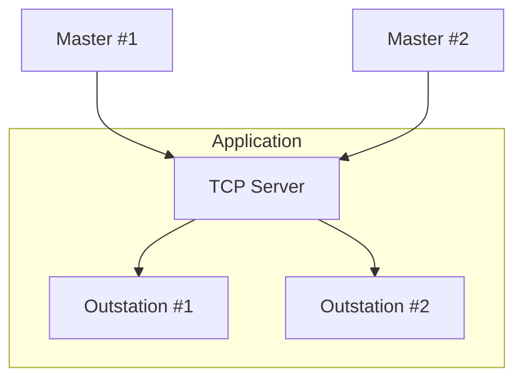

import Tabs from '@theme/Tabs';
import TabItem from '@theme/TabItem';

One or more outstation instances may be bound to a TCP server using an `AddressFilter`. Unlike most server protocols, each outstation instance may only
communicate with a single client at a time. This is because DNP3 is stateful and maintains event data for a *particular* master. If you need to support more than
one master connection on the same listening port you must preconfigure the master IP addresses and create an outstation instance for each master.



## Creating a server

The first step is to create a `TcpServer` instance. Creating a server does not initiate `bind/listen`.

<Tabs
groupId="language"
defaultValue="Rust"
values={[
{label: 'Rust', value: 'Rust'},
{label: 'C', value: 'C'},
{label: 'Java', value: 'Java'},
{label: 'C#', value: 'C#'},
]}>
<TabItem value="Rust">

```rust
{{#include ../dnp3/examples/outstation_tcp_server.rs:create_tcp_server}}
```

</TabItem>
<TabItem value="C">

```c
tcp_server_t server = NULL;
dnp3_param_error_t err = dnp3_tcpserver_new(runtime, DNP3_LINK_ERROR_MODE_CLOSE, "127.0.0.1:20000", &server);
```

</TabItem>
<TabItem value="Java">

```java
{{#include ../ffi/bindings/java/examples/src/main/java/io/stepfunc/dnp3rs/examples/OutstationExample.java:create_tcp_server}}
```

</TabItem>
<TabItem value="C#">

```csharp
{{#include ../ffi/bindings/dotnet/examples/outstation/Program.cs:create_tcp_server}}
{
    // use the server
}
```

</TabItem>
</Tabs>

:::tip
The `LinkErrorMode` controls what happens when malformed link-layer frames are received. The typical behavior is to close the socket
as data should never be corrupted over TCP.  This value may be set to `Discard` in which case the parser will discard errors and search for the start of the
next frame. This behavior is required if you are connecting to a terminal server which bridges TCP to a serial port.
:::

## Adding Outstation(s)

You can now associate one or more outstations with the `TcpServer`.