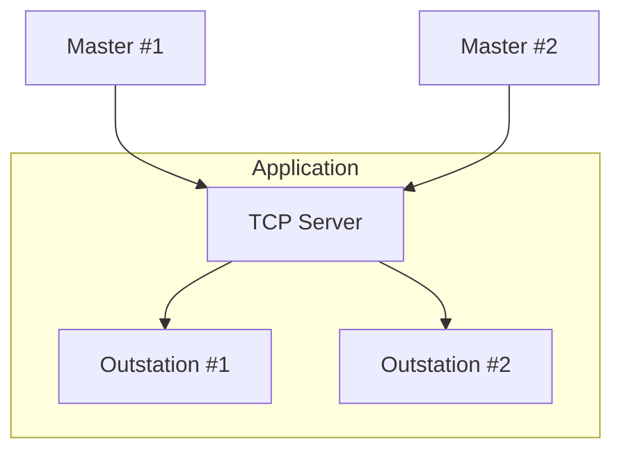
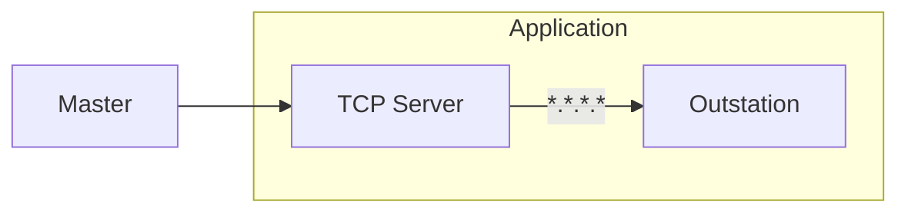

import Tabs from '@theme/Tabs';
import TabItem from '@theme/TabItem';

One or more outstation instances may be bound to a TCP server using an `AddressFilter`. Unlike most server protocols, each outstation instance may only
communicate with a single client at a time. This is because DNP3 is stateful and maintains event data for a *particular* master. If you need to support more than
one master connection on the same port, you must preconfigure each master IP address and associate it with a particular outstation.



## Creating a server

The first step is to create a `TcpServer` instance. Creating a server does not initiate `bind/listen`.

Addresses may be any specified as any valid IPv4 or IPv6 local endpoint, e.g.:

* `127.0.0.1` for localhost only
* `0.0.0.0` for all adapters
* IP address of a particular adapter

`TcpServer` creation can fail if the endpoint is not well formed: `<address>:<port>`.

<Tabs
groupId="language"
defaultValue="Rust"
values={[
{label: 'Rust', value: 'Rust'},
{label: 'C', value: 'C'},
{label: 'Java', value: 'Java'},
{label: 'C#', value: 'C#'},
]}>
<TabItem value="Rust">

```rust
{{#include ../dnp3/examples/outstation_tcp_server.rs:create_tcp_server}}
```

</TabItem>
<TabItem value="C">

```c
tcp_server_t server = NULL;
dnp3_param_error_t err = dnp3_tcpserver_new(runtime, DNP3_LINK_ERROR_MODE_CLOSE, "127.0.0.1:20000", &server);
```

</TabItem>
<TabItem value="Java">

```java
{{#include ../ffi/bindings/java/examples/src/main/java/io/stepfunc/dnp3/examples/OutstationExample.java:create_tcp_server}}
```

</TabItem>
<TabItem value="C#">

```csharp
{{#include ../ffi/bindings/dotnet/examples/outstation/Program.cs:create_tcp_server}}
{
    // use the server
}
```

</TabItem>
</Tabs>

:::tip
The `LinkErrorMode` controls what happens when malformed link-layer frames are received. The typical behavior is to close the socket
as data should never be corrupted over TCP.  This value may be set to `Discard` in which case the parser will discard errors and search for the start of the
next frame. This behavior is required if you are connecting to a terminal server which bridges TCP to a serial port.
:::

## Adding Outstation(s)

You can now associate one or more outstations with the `TcpServer`. The `TcpServer::addOutstation` method takes all of the components discussed in previous sections,
followed by an `AddressFilter`. The filter controls which masters are allowed to associate with a particular outstation. If the filter overlaps with the filter
of an existing outstation, i.e. they would both allow the same address, then `TcpServer::addOutstation` will fail.

<Tabs
groupId="language"
defaultValue="Rust"
values={[
{label: 'Rust', value: 'Rust'},
{label: 'C', value: 'C'},
{label: 'Java', value: 'Java'},
{label: 'C#', value: 'C#'},
]}>
<TabItem value="Rust">

```rust
{{#include ../dnp3/examples/outstation_tcp_server.rs:tcp_server_spawn_outstation}}
```

:::note
The terminology differs here between Rust and bindings. The Rust API's add_outstation method doesn't spawn it onto the runtime.
:::

</TabItem>
<TabItem value="C">

```c
dnp3_outstation_t outstation = NULL;
dnp3_address_filter_t *address_filter = dnp3_address_filter_any();
dnp3_param_error_t = err = dnp3_tcpserver_add_outstation(server, config, get_event_buffer_config(), application, information, control_handler, address_filter, &outstation);
dnp3_address_filter_destroy(address_filter);
if (err) {
    printf("unable to add outstation: %s \n", dnp3_param_error_to_string(err));
    // handle error
}
```

</TabItem>
<TabItem value="Java">

```java
{{#include ../ffi/bindings/java/examples/src/main/java/io/stepfunc/dnp3/examples/OutstationExample.java:tcp_server_add_outstation}}
```

</TabItem>
<TabItem value="C#">

```csharp
{{#include ../ffi/bindings/dotnet/examples/outstation/Program.cs:tcp_server_add_outstation}}
```

</TabItem>
</Tabs>

The examples above use `AddressFilter.any()` to allow any master IP address to connect:



If an outstation is already connected to a master, and another matching IP address attempts to connect, the existing connection will be closed and the
outstation will begin a communication session with the new master.

## Binding the Server

When all of the outstation associated with the server have been added, it is time to bind the server and begin accepting connections.

<Tabs
groupId="language"
defaultValue="Rust"
values={[
{label: 'Rust', value: 'Rust'},
{label: 'C', value: 'C'},
{label: 'Java', value: 'Java'},
{label: 'C#', value: 'C#'},
]}>
<TabItem value="Rust">

```rust
{{#include ../dnp3/examples/outstation_tcp_server.rs:server_bind}}
```

:::note
The terminology differs here between Rust and bindings.
:::

</TabItem>
<TabItem value="C">

```c
dnp3_param_error_t err = dnp3_tcpserver_bind(server);
if (err) {
    // handle error
}
```

</TabItem>
<TabItem value="Java">

```java
{{#include ../ffi/bindings/java/examples/src/main/java/io/stepfunc/dnp3/examples/OutstationExample.java:tcp_server_bind}}
```

</TabItem>
<TabItem value="C#">

```csharp
{{#include ../ffi/bindings/dotnet/examples/outstation/Program.cs:tcp_server_bind}}
```

</TabItem>
</Tabs>


Binding may fail if the underlying socket bind/listen calls fail, e.g. if another process is already bound to that port.