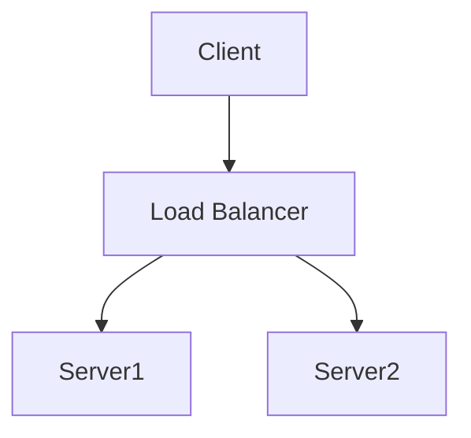

The example programs in this section are pulled directly from the source code repository, and may be compiled and run interactively. Each program reads
demonstrates the usage of various API features by reading console input from the user.

As you read through the examples, you may notice blocks of code surrounded by `// ANCHOR: <id>` and `// ANCHOR_END: <id>`

```c
// ANCHOR: logging

code that configures the logging ...

// ANCHOR_END: logging
```

These blocks of code are pulled from the example programs and used as snippets in this guide. This ensures that all of the snippets
that you encounter when reading the documentation are always syntactically valid as they extracted from working programs.



