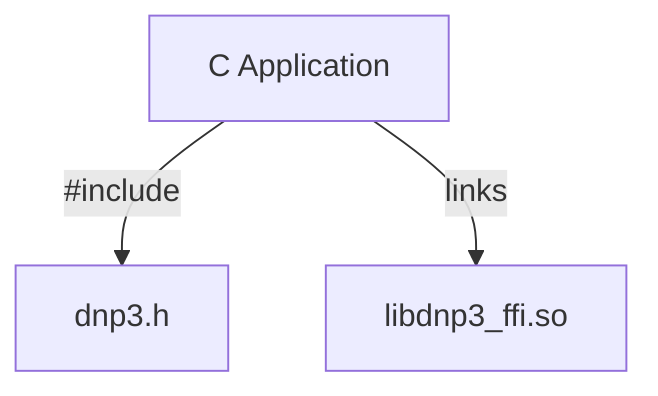

import useBaseUrl from '@docusaurus/useBaseUrl';
import sitedata from '../../sitedata.json'

The C bindings consist of a single header and a shared library which makes application integration straightforward:



The distribution contains:

* Single header file in `/include/dnp3.h`
* Platform-specific shared libraries in `/lib/<platform>`
* 3rd party license information in `third-party-licenses.txt`
* CMake find package script in `/cmake/`

:::tip
The CMake script is just a recipe for how you might integrate the library. You don't have to use it. Our distribution contains a single header file
and a shared library that can be easily linked. Assuming that you've installed the shared library in /usr/lib, linking a program could be as simple
as:

```
> gcc main.c -I./c-bindings/include -ldnp3_ffi
> ldd a.out
        linux-vdso.so.1 (0x00007ffec093e000)
        libdnp3_ffi.so => /lib/libdnp3_ffi.so (0x00007f0054630000)
        libc.so.6 => /lib/x86_64-linux-gnu/libc.so.6 (0x00007f005443e000)
        libgcc_s.so.1 => /lib/x86_64-linux-gnu/libgcc_s.so.1 (0x00007f0054423000)
        librt.so.1 => /lib/x86_64-linux-gnu/librt.so.1 (0x00007f0054419000)
        libpthread.so.0 => /lib/x86_64-linux-gnu/libpthread.so.0 (0x00007f00543f6000)
        libm.so.6 => /lib/x86_64-linux-gnu/libm.so.6 (0x00007f00542a7000)
        libdl.so.2 => /lib/x86_64-linux-gnu/libdl.so.2 (0x00007f005429f000)
        /lib64/ld-linux-x86-64.so.2 (0x00007f0054c7c000)
```
:::

The example above shows how dependencies might look for an executable linked on a GLIBC based distribution such as Ubuntu. Libraries are also available for MUSL
distributions such as Alpine Linux.

```
> ldd a.out
        /lib/ld-musl-x86_64.so.1 (0x7fbb1edeb000)
        libdnp3_ffi.so => /usr/lib/libdnp3_ffi.so (0x7fbb1e894000)
        libc.musl-x86_64.so.1 => /lib/ld-musl-x86_64.so.1 (0x7fbb1edeb000)
        libgcc_s.so.1 => /usr/lib/libgcc_s.so.1 (0x7fbb1e87b000)
```


To use the provided CMake find package script, make it discoverable by adding it to the prefix path. Next, call `find_package`:

```cmake
set(CMAKE_PREFIX_PATH ${DISTRIBUTION_PATH}/cmake)
set(DNP3_RUST_TARGET x86_64-unknown-linux-gnu)
find_package(rodbus REQUIRED)
```

:::tip
The DNP3_RUST_TARGET variable can also be set via the command line when configuring cmake. It just tells the script which library to link.

```
> mkdir build; cd build
> cmake .. -DDNP3_RUST_TARGET=x86_64-unknown-linux-gnu
```
:::

This call will expose the library target:

- `dnp3` which is the library. When using this target, you must make the DLL or .so file available to your executable. You can automatically copy it to the executable target directory using the following CMake
  statement:

```cmake
add_custom_command(TARGET my_awesome_project POST_BUILD 
    COMMAND ${CMAKE_COMMAND} -E copy_if_different $<TARGET_FILE:dnp3> $<TARGET_FILE_DIR:my_awesome_project>
)
```

Finally, declare a dependency on the library for your executable:

```cmake
add_executable(my_awesome_project main.c)
target_link_libraries(my_awesome_project PRIVATE dnp3)
```

## Mapping

Many of the concepts built into higher-level languages are just design patterns or idioms in C. When you see these higher levels patterns discussed in this guide, you can use the idioms to understand how they map to C.

### Classes

C doesn't have classes with restricted member visibility. Instead, you can use opaque types to hide implementation details:

```c
typedef struct opaque_type_t;
```

You can then define `constructors` and `destructors` as functions:

```c
// constructor
opaque_type_t* create_opaque_type();
//destructor
void destroy_opaque_type(opaque_type_t* instance);
```

Class "member functions" are simply functions that take a pointer to the opaque type as the first argument:

```c
int opaque_type_get_special_value(opaque_type_t* instance)
```

### Interfaces

C accomplishes function polymorphism using function pointers. Interfaces are simply collections of function pointers
along with some optional context. For example, let's look at the following logging interface in the library:

```c
typedef struct dnp3_logger_t
{
    void (*on_message)(dnp3_log_level_t level, const char* message, void* ctx);
    void (*on_destroy)(void* ctx);
    void* ctx;
} dnp3_logger_t;
```

* `ctx` is an opaque pointer to some state information required by the interface. It is passed into every method as the final argument.
* `on_destroy` is the destructor that cleans up the `ctx`.
* `on_message` is a function pointer used to dispatch a log message.

Keep in mind that this example only contains a single method. Other interfaces will contain several methods.

:::warning
Always use [C99 struct initialization](https://en.cppreference.com/w/c/language/struct_initialization) when defining interfaces
as this will guarantee that fields you don't explicitly initialize are set to NULL.
:::

:::tip
The FFI library will interpret NULL function pointers as "not-defined" and will use an intelligent default for this method of
the interface. The `ctx` value may be NULL as well if your interface is stateless.
:::

### Iterators

Collections in the C bindings are always implemented as an opaque iterator type. Think of them as a class with a single "next" method. For example, let's look at an iterator over bool values:

```c
// opaque iterator
typedef struct bool_iterator_t;
// next function
bool* bool_iterator_next(bool_iterator_t* iter);
```

If you are given this iterator in a callback, you can process the values in a loop:

```c
void my_callback(bool_iterator_t* iter, void* ctx)
{
    bool* value = NULL;
    while(value = bool_iterator_next(iter))
    {
        // process value
    }
}
```

:::warning
Never use an iterator outside the callback. Frequently, the iterator points to memory on the stack and will result in undefined behavior if it is used after the callback is complete.
:::

### Error Handling

C API error handling is performed using error codes. An error code is always an enum value where the first value is equal to zero, indicating success.

Consider an error enum and a function that parses a string as an `int` that can fail:

```c
typedef enum my_error_t
{
    MY_ERROR_OK = 0,
    MY_ERROR_BAD_INT_STRING = 1,
} my_error_t;

my_error_t parse_string(const char* string, int* out);
```

When a function that can fail needs to return a value, it always does so using an out parameter as the last argument. Your code should always check for returned error values:

```c
int value = 0;
my_error_t err = parse_string("not a number", &value);
if(err) {
   printf("unable to parse number: %s\n", my_error_to_string(err));
   // handle error
}
```

:::note
Every enum generated by the C code generator also has a generated `*_to_string` helper method for debugging.
:::
