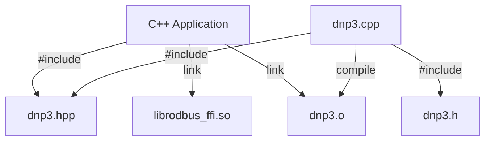

import useBaseUrl from '@docusaurus/useBaseUrl';
import sitedata from '../../sitedata.json'

Each [C package distribution](./c_lang.mdx) also includes a C++ API that fully wraps the C API. The `dnp3.hpp` defines the public API
and a `src/dnp3.cpp` maps this API to the underlying C API.




## CMake Usage

The CMake package script includes a `dnp3_cpp` target that automatically links with the C bindings and builds the C++ wrapper code.

Make the find package script discoverable by adding it to the prefix path. Next, call `find_package`:

```cmake
# Define CMake project with CXX language
project(my_awesome_project LANGUAGES C CXX)

# Import the dnp3 package
set(CMAKE_PREFIX_PATH ${DISTRIBUTION_PATH}/cmake)
# Tell cmake which library we're linking
set(DNP3_RUST_TARGET x86_64-unknown-linux-gnu)
find_package(dnp3 REQUIRED)

# Create and link the executable
add_executable(my_awesome_project main.cpp)
target_link_libraries(my_awesome_project PRIVATE dnp3_cpp)
```

:::note
The `dnp3_cpp` CMake target is made available only if the `CXX` language is enabled. Languages can be enabled in the
[project()](https://cmake.org/cmake/help/latest/command/project.html) command or with a separate
[enable_language()](https://cmake.org/cmake/help/latest/command/enable_language.html) command.
:::

## Mapping

Most of the abstract concepts in the binding generator map directly to C++.

### Errors

All C API errors are transformed into a C++ exceptions containing the error enum. All exceptions derive from `std::logic_error`.

Other validations (e.g. checking that a moved class isn't used after the move) also throw `std::logic_error`.

:::warning
Uncaught exceptions thrown in callbacks will terminate the program. Always wrap your callback logic using `try/catch` syntax if there's a possibility the callback will throw.
:::

### Iterators

Iterators are wrapped in a class for easier manipulation. Iterating on them should done like so:

```cpp
while(iter.next()) {
    auto value = iter.get();
}
```

The `next()` advances the iterator and returns `true` if a value is available. The `get()` returns the current value pointed, or throws
`std::logic_error` if the end was reached.

:::warning
The iterator wrapper does **not** copy and accumulate the values like in C# or Java. Therefore, an iterator should **never** be used outside of the callback.
Frequently, the iterator points to memory on the stack and will result in undefined behavior if it is used after the callback is complete.
:::

### Collections

Collections are taken through a constant reference to a `std::vector`. The elements will be copied internally.

### Classes

Classes have a opaque pointer inside and therefore cannot be copied. They can be moved around with `std::move`. If a method
is called on a moved class it throw a `std::logic_error`.

The class destructor will call the underlying C destructor automatically.

### Interfaces

Interfaces are abstract classes containing only pure virtual functions where every callback must be implemented. The destructor is virtual to allow proper cleanup.

Owned interfaces that are invoked asynchronously by the library are passed into the API as a `std::unique_ptr<T>`. Use `std::make_unique` to create these smart pointers.

Non-owned (synchronous) interfaces are passed by reference. There are also functional wrappers that take a lambda
function as an argument available in the `dnp3::functional` namespace.

### Async methods

C++ doesn't have a robust model for asynchronous computations in the standard library (yet). You can only extract a value
from a C++ `std::future` using the blocking `get` method and there is no way to chain asynchronously chain futures.

Asynchronous methods are mapped to callback interfaces with two methods:

* `on_complete` is called when the operation succeeds
* `on_failure` is called if an error occurs

If you already use an external futures library, it will be easy to use our callbacks to complete your futures.